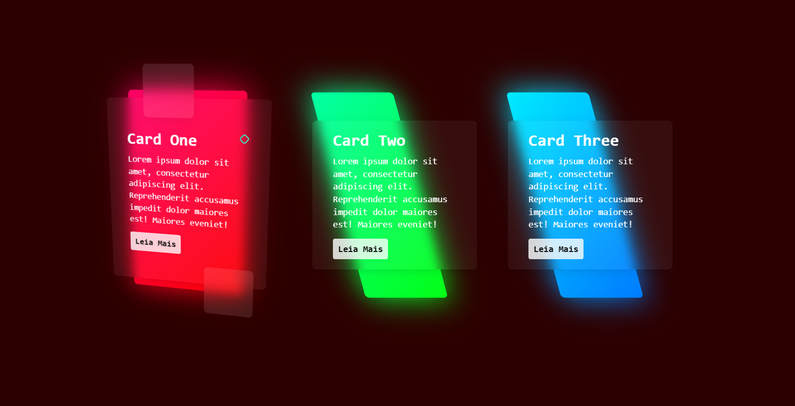

<!-- Projeto Finalizado -->
# 📚 Cartões Dinâmicos com Efeito de Inclinação
<p align="center">
  <!-- Contador de linguagens do GitHub -->
  
  <!-- Tamanho do repositório no GitHub -->
  
  <!-- Licença do GitHub -->
  
</p>

<div align="center">
  
</div>

## ⚙️ Funcionalidades
- **Alteração de Cor de Fundo:** Muda a cor da página ao passar o mouse sobre os cartões.
- **Efeito de Inclinação:** Cartões com efeito de inclinação suave usando VanillaTilt.
- **Cursor Personalizado:** Cursor estilizado seguindo o movimento do mouse.

## 🛠️ Tecnologias Utilizadas
- **HTML:** Estrutura básica do documento.
- **CSS:** Estilização dos cartões e do layout geral.
- **JavaScript:** Interatividade, incluindo [VanillaTilt.js](https://github.com/micku7zu/vanilla-tilt.js) e script para cursor.

## 🔎 Demonstração
Você pode visualizar o projeto online através deste [link](https://devandreotti.github.io/gradient-cards/).

## 🚀 Como Executar
1. Clone o repositório:
   ```bash
   git clone https://github.com/devAndreotti/gradient-cards.git
   ```
2. Abra o `index.html` no navegador.

## 💪 Contribuição
Contribuições são bem-vindas! Para contribuir, siga estas etapas:
1. Faça um fork do projeto.
2. Crie uma nova branch para sua feature `git checkout -b feature/nome-feature`.
3. Commit suas mudanças `git commit -m 'Adiciona nova feature'`.
4. Envie para a branch `git push origin feature/nome-feature`.
5. Abra um Pull Request.

## 📌 Nota
Este projeto é para fins educacionais e demonstra a manipulação dinâmica de estilos com CSS e JavaScript. Sinta-se livre para explorar, modificar e adaptar conforme necessário.

<br>

---
<p align="center"> Desenvolvido por <a href="https://github.com/devAndreotti">Ricardo Andreotti Gonçalves</a> </p>
